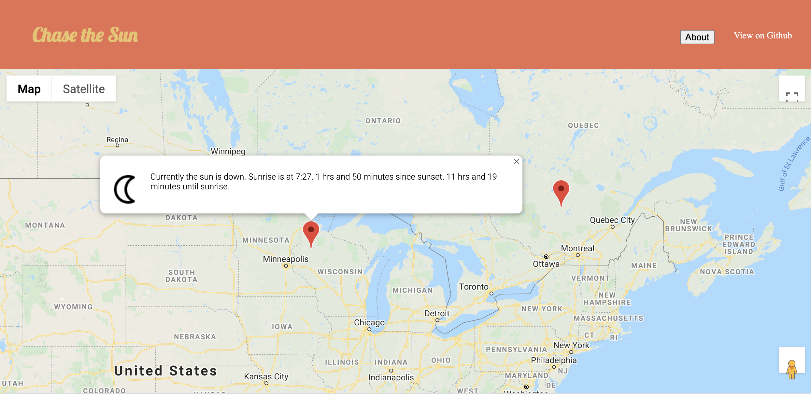

# Chase the Sun app

## Link to live app
https://mittsc01.github.io/chase-the-sun/

## photos

## Summary

This app allows the user to click on a map and provides the following feedback:

1) If the sun is currently up or down where the map was clicked.
2) The time since sunrise/sunset and the time until sunset/sunrise
3) The local time of the most proximate future sun event.
## Technologies Used
- Javascript
- JQuery
- HTML
- CSS
- Google Maps APIs
